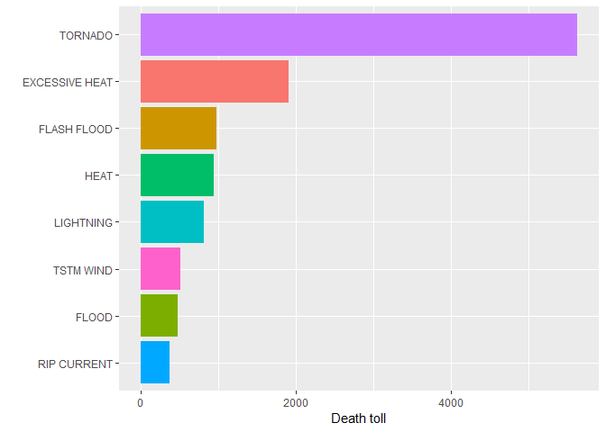
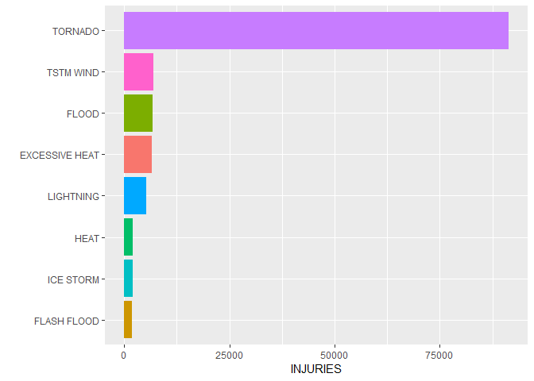
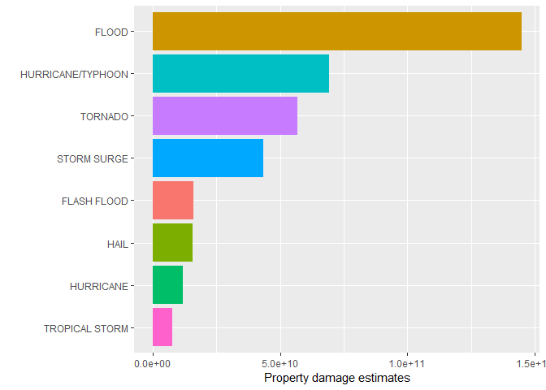

# Synopsis

Storms and other weather events can cause significant damage. This analysis attempts to determine which weather events are most harmful to population health and the economy.
# Data Processing

I'm going to use The U.S. National Oceanic and Atmospheric Administration's (NOAA) storm database.


Download file:

```r
link <- "http://d396qusza40orc.cloudfront.net/repdata%2Fdata%2FStormData.csv.bz2"
download.file(url = link, destfile = "StormData")
```

Read a file in table format

```r
StormData <- read.csv(bzfile("StormData"),sep = ",",header=TRUE)
```

The PROPDMG variable, which estimates damage to the property, contains letters such as B or M that mean quantities, but I need the PROPDMG variable to be numerical to be able to represent it graphically. To achieve this, I create the new PROPDMGEXP2 variable and establish equivalences between the letters of PROPDMG and their numerical value. Before generating the corresponding graph, I will multiply the two variables to have the data in directly comparable quantities.


```r
table(StormData$PROPDMGEXP)
```

```
## 
##             -      ?      +      0      1      2      3      4      5 
## 465934      1      8      5    216     25     13      4      4     28 
##      6      7      8      B      h      H      K      m      M 
##      4      5      1     40      1      6 424665      7  11330
```

```r
StormData$PROPDMGEXP2 <- 1
StormData$PROPDMGEXP2[which(StormData$PROPDMGEXP == "K")] <- 1000
StormData$PROPDMGEXP2[which(StormData$PROPDMGEXP == "M" | StormData$PROPDMGEXP == "m")] <- 1000000
StormData$PROPDMGEXP2[which(StormData$PROPDMGEXP == "B")] <- 1000000000
```


```r
table(StormData$PROPDMGEXP2)
```

```
## 
##      1   1000  1e+06  1e+09 
## 466255 424665  11337     40
```

# Which types of events are most harmful to population health?

Deaths and injuries have the greatest impact on population health, so I will rely on those damages to determine which events are the most harmful to population health.

This plot presents a death toll by event type.


```r
StormData %>%
      select(FATALITIES, EVTYPE) %>%
      group_by(EVTYPE) %>%
      summarise(SumFATALITIES = sum(FATALITIES)) %>%
      top_n(n = 8, wt = SumFATALITIES) %>%
      ggplot(aes(y = SumFATALITIES, x = reorder(x = EVTYPE, X = SumFATALITIES), fill=EVTYPE))+
      geom_bar(stat = "identity", show.legend = FALSE) +
      #geom_text(aes(label=SumFATALITIES), size = 4, hjust = 0.5, vjust = -0.1) +
      xlab(label = "") +
      ylab(label = "Death toll") +
      coord_flip() +
      theme_grey()
```

<!-- -->

The plot below presents injuries by event type.


```r
StormData %>%
      select(INJURIES, EVTYPE) %>%
      group_by(EVTYPE) %>%
      summarise(SumINJURIES = sum(INJURIES)) %>%
      top_n(n = 8, wt = SumINJURIES) %>%
      ggplot(aes(y = SumINJURIES, x = reorder(x = EVTYPE, X = SumINJURIES), fill=EVTYPE))+
      geom_bar(stat = "identity", show.legend = FALSE) +
      #geom_text(aes(label=SumINJURIES), size = 4, hjust = 0.5, vjust = -0.1) +
      xlab(label = "") +
      ylab(label = "INJURIES") +
      coord_flip() +
      theme_grey()
```

<!-- -->

# Which types of events have the greatest economic consequences?

This plot shows property damage estimates by event type.


```r
StormData %>%
      select(PROPDMG, PROPDMGEXP2, EVTYPE) %>%
      group_by(EVTYPE) %>%
      mutate(SumPROPDMGEXP = (PROPDMG * PROPDMGEXP2)) %>%
      summarise(SumPROPDMGEXP2 = sum(SumPROPDMGEXP)) %>%
      top_n(n = 8, wt = SumPROPDMGEXP2) %>%
      ggplot(aes(y = SumPROPDMGEXP2, x = reorder(x = EVTYPE, X = SumPROPDMGEXP2), fill=EVTYPE))+
      geom_bar(stat = "identity", show.legend = FALSE) +
      #geom_text(aes(label=SumFATALITIES), size = 4, hjust = 0.5, vjust = -0.1) +
      xlab(label = "") +
      ylab(label = "Property damage estimates") +
      coord_flip() +
      theme_grey()
```

<!-- -->

# Conclusion

#### Flood has the greatest economic consequences. Tornado is the most harmful to population health.


.
